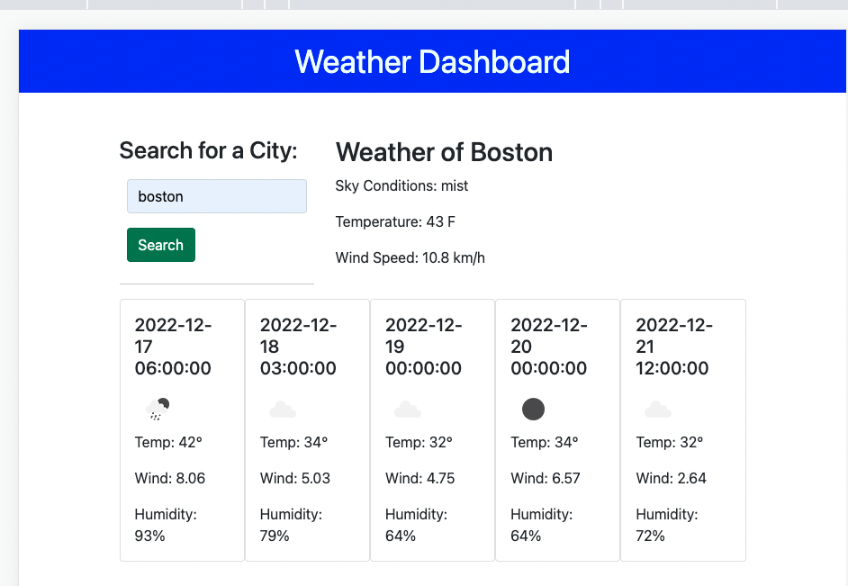

# Weather Dashboard

## Description
An app to search weather forecast by city, and provide a 5-day forecast from current date. The site provides an easy way to check weather by city name. I was able to practice Javascript and the ability to place content dynamically in HTML.

## Installation

N/A

## Usage

In the search field, type a US City name, click on search to see current weather and 5 day forecast.

## Credits

Google

https://www.w3schools.com/

## License

Please refer to the license in the Repo.

